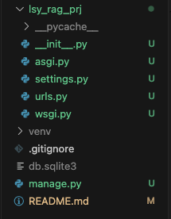
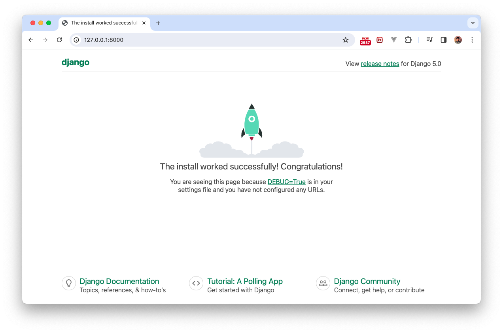
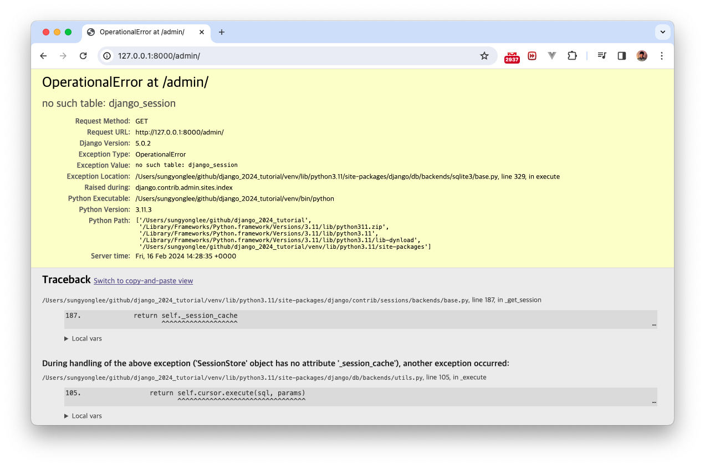
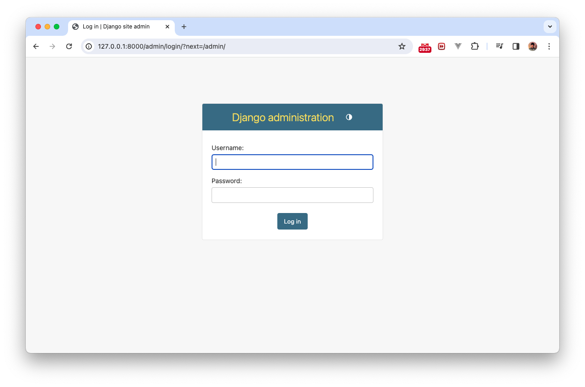
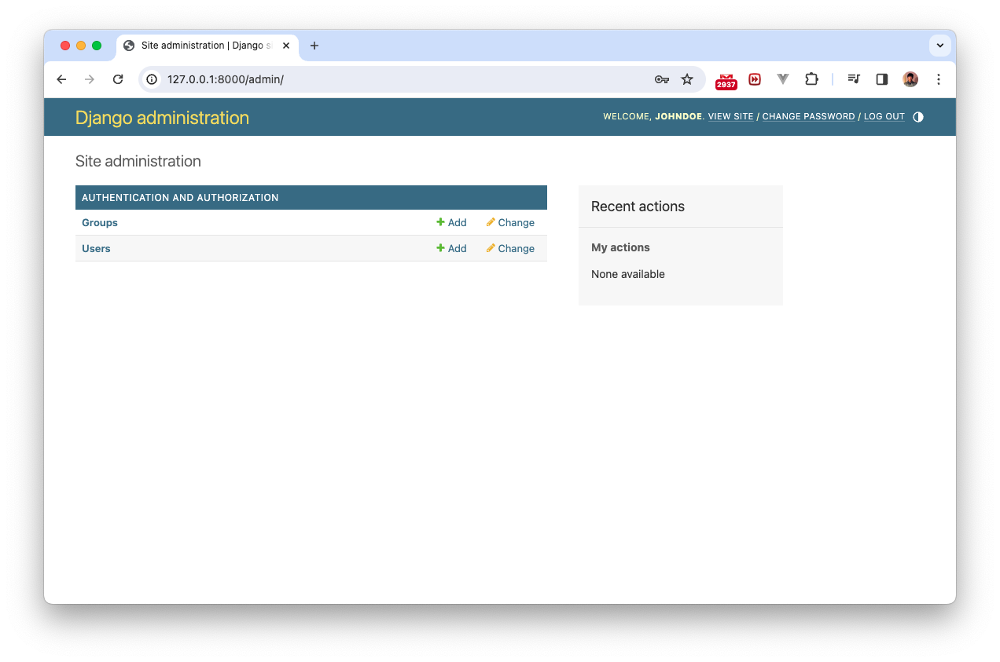

## Django 초기화
### 가상환경 설정
```console
% python3 -m venv venv
% source venv/bin/activate
```
### 장고 설치
```console
(venv) % pip install django

Collecting django
  Using cached Django-5.0.2-py3-none-any.whl (8.2 MB)
Collecting asgiref<4,>=3.7.0
  Using cached asgiref-3.7.2-py3-none-any.whl (24 kB)
Collecting sqlparse>=0.3.1
  Using cached sqlparse-0.4.4-py3-none-any.whl (41 kB)
Installing collected packages: sqlparse, asgiref, django
Successfully installed asgiref-3.7.2 django-5.0.2 sqlparse-0.4.4
```

앞으로 이후 문서에 `(venv)`라고 되어 있지 않아도 항상 이 가상환경 상태에서 작업을 해야함

### django 프로젝트 생성
`django-admin startproject 프로젝트명 .` 

마지막에 `.`를 붙여야 현재 폴더에 만든다. 

```console
% django-admin startproject lsy_rag_prj .
```

프로젝트가 생성됨




### 서버를 띄워보자

```console
% python manage.py runserver

Watching for file changes with StatReloader
Performing system checks...

System check identified no issues (0 silenced).

You have 18 unapplied migration(s). Your project may not work properly until you apply the migrations for app(s): admin, auth, contenttypes, sessions.
Run 'python manage.py migrate' to apply them.
February 16, 2024 - 14:08:23
Django version 5.0.2, using settings 'lsy_rag_prj.settings'
Starting development server at http://127.0.0.1:8000/
Quit the server with CONTROL-C.
```



### admin에 들어가자
table이 없어서 벌어지는 문제


db에 테이블을 만들자.
```console
(venv)% python manage.py makemigrations
No changes detected

(venv)% python manage.py migrate
Operations to perform:
  Apply all migrations: admin, auth, contenttypes, sessions
Running migrations:
  Applying contenttypes.0001_initial... OK
  Applying auth.0001_initial... OK
  Applying admin.0001_initial... OK
  Applying admin.0002_logentry_remove_auto_add... OK
  Applying admin.0003_logentry_add_action_flag_choices... OK
  Applying contenttypes.0002_remove_content_type_name... OK
  Applying auth.0002_alter_permission_name_max_length... OK
  Applying auth.0003_alter_user_email_max_length... OK
  Applying auth.0004_alter_user_username_opts... OK
  Applying auth.0005_alter_user_last_login_null... OK
  Applying auth.0006_require_contenttypes_0002... OK
  Applying auth.0007_alter_validators_add_error_messages... OK
  Applying auth.0008_alter_user_username_max_length... OK
  Applying auth.0009_alter_user_last_name_max_length... OK
  Applying auth.0010_alter_group_name_max_length... OK
  Applying auth.0011_update_proxy_permissions... OK
  Applying auth.0012_alter_user_first_name_max_length... OK
  Applying sessions.0001_initial... OK

(venv)% python manage.py runserver     
Watching for file changes with StatReloader
Performing system checks...

System check identified no issues (0 silenced).
February 16, 2024 - 15:27:21
Django version 5.0.2, using settings 'lsy_rag_prj.settings'
Starting development server at http://127.0.0.1:8000/
Quit the server with CONTROL-C.

```

새로고침 하면


`super user` 만들기
```console
(venv)% python manage.py createsuperuser
Username (leave blank to use 'sungyonglee'): johndoe 
Email address: john@doe.com
Password: 
Password (again): 
Superuser created successfully.
```



### 초기화만 했을 뿐인데 어떻게 된걸까?

`127.0.0.1:8000/admin/`로 시작하는 URL로 접근했을 때에 장고가 해야할 일이 기본적으로 정해져있다.

`admin`은 장고에서 기본으로 제공한다. 이 맛에 장고 쓴다.
```python
# project 폴더 urls.py

from django.contrib import admin
from django.urls import path

urlpatterns = [
    path('admin/', admin.site.urls),
]
```