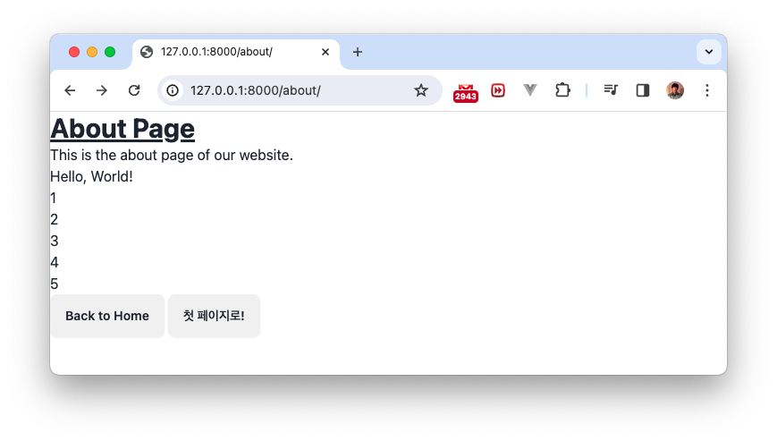

## App
장고는 `app` 단위로 기능을 개발한다. 예를 들어 인스타그램을 만든다면, feed를 올리는 feed앱, 메신저 앱, 사진 수정을 하는 앱 이런 식으로 단위를 나눌 수 있다. 앱 단위로 나누는 기준은 개발자 마음. 

### 단순한 앱 만들기
처음 만들 앱은 그냥 연습삼아 페이지만 보여주는 앱 `single_pages`!

```console
(venv)% python manage.py startapp single_pages
```
새로운 폴더와 파일이 생겼다. 


### settings.py에 등록하기
프로젝트명/settings.py의 `INSTALLED_APPS`에 새로 만든 앱 등록

```python
# 프로젝트명/settings.py
...

INSTALLED_APPS = [
    'django.contrib.admin',
    'django.contrib.auth',
    'django.contrib.contenttypes',
    'django.contrib.sessions',
    'django.contrib.messages',
    'django.contrib.staticfiles',
    
    'single_pages', # <-- 
]

...
```

### URL 연결하기
현재는 프로젝트의 urls.py에 single_pages 앱을 사용하기 위한 경로를 지정하지 않았으므로, 아래와 같이 지정한다. 

```python
# 프로젝트명/urls.py
from django.contrib import admin
from django.urls import path, include # <- include 추가

urlpatterns = [
    path('admin/', admin.site.urls),
    path('', include('single_pages.urls')), # <- 도메인 뒤에 admin으로 시작하지 않으면 single_pages 앱의 urls.py를 조회
]

```
하지만 아직 single_pages 앱에 urls.py가 없는 상황이다.
python manage.py runserver 해보면 아래와 같이 에러 메시지가 나온다. 
```console
ModuleNotFoundError: No module named 'single_pages.urls'
```

single_pages 폴더에 urls.py를 만들고 아래와 같이 적어준다. 
```python
# single_pages/urls.py

from django.urls import path
from . import views

urlpatterns = [
    path('', views.index, name='index'),
]

```
django는 `127.0.0.1:8000`뒤에 아무 것도 없어서 `single_pages.urls`를 조회하러 온 상태다. 위 내용은 "여기에서 아무것도 없을 때 (`''`)일 때, views.py의 index 함수를 실행시키라"는 뜻. 

### view 등록하기
template에서 쓰는 아래 세가지 내용을 배우기 위한 예제다. 
> [!NOTE]
> - extends 
> - block
> - url


```python
# single_pages/views.py
from django.shortcuts import render

def index(request):
    return render(
        request, 
        'single_pages/index.html'
    )
```
이제 브라우저에서 `127.0.0.1:8000`에 들어가보면 index.html 파일이 없다고 한다. 


- single_pages 폴더에 templates 폴더를 만들고, 
- 그 아래에 single_pages 폴더를 만든 뒤, 
- index.html 생성

```html
<!DOCTYPE html>
<html>
<head>
    <title>이성용 웹사이트</title>
</head>
<body>
    <h1>Welcome to my website!</h1>
</body>
</html>
```
이제 다시 127.0.0.1:8000 을 열어보면, 짜잔


## Template 익히기
복습 삼아 about 페이지도 만들자
`single_pages/urls.py`에 url 등록하고, 

```python
# single_pages/urls.py
from django.urls import path
from . import views

urlpatterns = [
    path('about/', views.about, name='about'), # <---
    path('', views.index, name='index'),
]

```

`single_pages/views.py`에 about 함수 등록하고,
```python
from django.shortcuts import render


def index(request):
    return render(
        request, 
        'single_pages/index.html'
    )
    
def about(request): # <----
    return render(
        request, 
        'single_pages/about.html'
    )
```

`single_pages/about.html` 만든다. 
```html
<!-- single_pages/about.html -->



  <h1 class="text-3xl font-bold underline">About Page</h1>
  <p>This is the about page of our website.</p>

  <a class="btn" href="">Back to Home</a>
  <a class="btn" href="/">첫 페이지로!</a>



```
여기서 새로운 개념이 두개 나왔다. `extends`, `block`, `url`

### extends
웹사이트는 모든 페이지에서 스타일이나 헤더, 푸터 등의 내용을 동일하게 사용한다. 이런 요구를 충족시키기 위해 base가 되는 html 템플릿을 만들고, 필요한 템플릿에서 extends 해서 사용한다. 

`about.html`에서 `base.html`을 extends 했고, 그 파일을 아래와 같이 만들었다. 

`tailwind CSS 프레임워크`와 `daisyUI`를 사용했다.  

```html
<!-- single_pages/templates/single_pages/base.html -->
<!DOCTYPE html>
<html>
  <head>
    <meta charset="UTF-8" />
    <meta name="viewport" content="width=device-width, initial-scale=1.0" />
    
    <link href="https://cdn.jsdelivr.net/npm/daisyui@4.7.2/dist/full.min.css" rel="stylesheet" type="text/css" />
    <script src="https://cdn.tailwindcss.com"></script>
  </head>
  <body>
    
      <h1 class="text-3xl font-bold underline">Hello world!</h1>
    
  </body>
</html>

```

### block
위 `base.html`과 `about.html`파일을 보면, `{% block content}`와 ``으로 되어 있는 부분이 있다. about.html에서 base.html를 extends해서 사용할 때, 블록명(여기서는 content)가 일치하는 부분이 있으면, base.html의 해당 블록 부분을 about.html의 내용으로 대체한다. 

### url
아래는 동일한 버튼이다. ``로 urls.py에 지정한 name으로 쓸 수도 있고, 그냥 `href="/"`이런 식으로 써도 동일하다. 
```html
...
  <a class="btn" href="">Back to Home</a>
  <a class="btn" href="/">첫 페이지로!</a>
...
```

`127.0.0.1:8000/about/`에 가보면 CSS까지 잘 적용되어 있다.


## view에서 template으로 값 넘기기
views.py에서 값을 dict로 넘기고, 
```python
# single_pages/views.py
...
def about(request):
    return render(
        request, 
        'single_pages/about.html', 
        {
            'greeting': 'Hello, World!',
            'numbers': [1, 2, 3, 4, 5]
        }
    )
...
```
템플릿에서 받을 수 있다. 
```html



  <h1 class="text-3xl font-bold underline">About Page</h1>
  <p>This is the about page of our website.</p>

  <p>{{ greeting }}</p>

  <ul>
    
      <li>{{ i }}</li>
    
  </ul>

  <a class="btn" href="">Back to Home</a>
  <a class="btn" href="/">첫 페이지로!</a>


```
`for`문이 어떻게 템플릿에서 사용되는지 볼 수 있는 예제

변수는 `{{ }}`로 표시한다. 그럼 그 빈칸이 채워지는 형태가 된다. 


