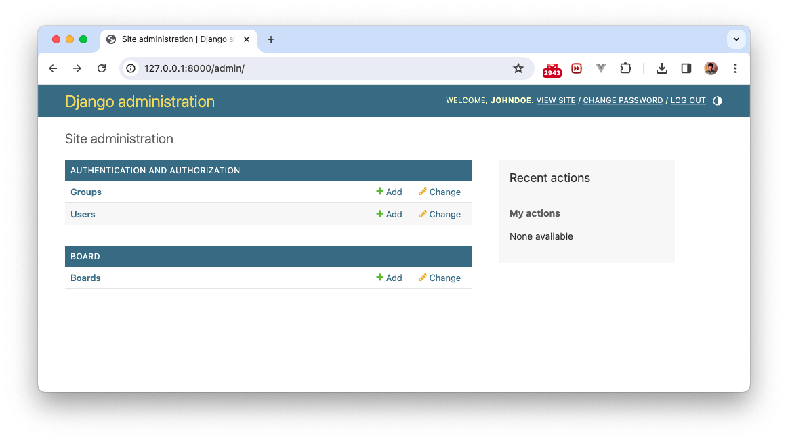

## MTV (model, template, view)
장고는 MTV 구조다. 원래 일반적으로 웹개발에서 MVC구조라고 부르는 것에 대응하는 개념이다. 

### MVC vs MTV
(Model, View, Controller)
MVC의 개념은 아래 그림과 같다. 

#### MVC

(이미지출처: https://tibetsandfox.tistory.com/16)

#### MTV
MVC나 MTV나 그게 그거 아닌가 싶다. Model의 역할은 동일하고, Template은 View에 대응되고, Controller는 View에 대응된다. 


(이미지출처: https://tibetsandfox.tistory.com/16)

### 연습. View 만으로 구성하기
여태까지는 Template + View 조합으로 about 페이지와 index 페이지를 만들었다. 

이제 view만으로도 만드는 연습을 해보자. 
```python
# single_pages/urls.py

from django.urls import path
from . import views

urlpatterns = [
    path('json_response_practice/', views.json_response_practice, name='json_response_practice'), # <--
    path('http_response_practice/', views.http_response_practice, name='http_response_practice'),  # <--
    path('about/', views.about, name='about'),
    path('', views.index, name='index'),
]

```

```python
# single_pages/views.py
from django.shortcuts import render
from django.http import HttpResponse, JsonResponse

...

def http_response_practice(request):
    return HttpResponse('Hello, World! This is a practice of HttpResponse.')

def json_response_practice(request):
    return JsonResponse({
        'message': 'Hello, World! This is a practice of JsonResponse.',
        'numbers': [1, 2, 3, 4, 5]
    })
```

http://127.0.0.1:8000/http_response_practice/


http://127.0.0.1:8000/json_response_practice/


## Model
모델은 각 앱에서 db 데이터 테이블 형태와 기능을 정의한다.

게시판을 만들어보자. 게시판 기능을 위해 새로운 앱 `board`를 만든다. 
```console
(venv)% python manage.py startapp board
```

board 앱 폴더가 생성되었다. 


이제 `프로젝트폴더/settings.py`에 새로 만든 앱을 등록한다. 

```python
# 프로젝트폴더/settings.py

INSTALLED_APPS = [
    'django.contrib.admin',
    'django.contrib.auth',
    'django.contrib.contenttypes',
    'django.contrib.sessions',
    'django.contrib.messages',
    'django.contrib.staticfiles',
    
    'single_pages',
    'board',
]
```

### Model: 모델 정의하기
그 안의 models.py에 아래와 같이 정의한다. 

```python
from django.db import models


class Board(models.Model):
    title = models.CharField(max_length=100)
    content = models.TextField()
    
    author = models.ForeignKey(
        'auth.User',
        on_delete=models.CASCADE,
    )
    
    created_at = models.DateTimeField(auto_now_add=True)
    updated_at = models.DateTimeField(auto_now=True)
    
    def __str__(self):
        return self.title
```
이 코드는 Django, Python의 웹 프레임워크에서 사용하는 모델을 정의하는 코드입니다. Django의 모델은 데이터베이스의 테이블을 Python 코드로 표현한 것입니다.

Board라는 이름의 모델 클래스를 정의하고 있습니다. 이 클래스는 models.Model을 상속받아 Django가 이 클래스를 데이터베이스 모델로 인식하게 합니다.

모델 클래스 내부에 정의된 각 변수는 데이터베이스 테이블의 컬럼을 나타냅니다.

- `title`: 최대 길이가 100인 문자열을 저장하는 필드입니다.
- `content`: 텍스트 필드로, 긴 문자열을 저장할 수 있습니다.
- `author`: 외래 키 필드로, 'auth.User' 모델을 참조합니다. 이는 게시글의 작성자를 나타냅니다. on_delete=models.CASCADE는 이 게시글의 작성자가 삭제되면, 해당 게시글도 함께 삭제되는 옵션입니다.
- `created_at`: DateTime 필드로, 게시글이 생성된 시간을 저장합니다. auto_now_add=True는 이 필드가 자동으로 객체가 처음 생성될 때 현재 시간으로 설정되게 합니다.
- `updated_at`: DateTime 필드로, 게시글이 마지막으로 수정된 시간을 저장합니다. auto_now=True는 이 필드가 자동으로 객체가 저장될 때마다 현재 시간으로 설정되게 합니다.

마지막으로 __str__ 메소드는 이 모델의 인스턴스를 문자열로 표현할 때 사용하는 메소드입니다. 이 경우, 게시글의 제목이 반환됩니다. 이 메소드는 Django 관리자 페이지나 쉘 등에서 객체를 표현할 때 유용합니다.

### 마이그레이션 하기
makemigrations와 migrate를 하자. 알아서 DB 마이그레이션을 해준다. 
`makemigrations`는 models.py를 읽어서 기존 DB와 달라진게 있는지 확인하고 있으면, 앱폴더/migrations 에 마이그레이션을 해주는 코드를 자동 생성해준다. 

`migrate`는 그 만들어진 migrations 폴더 밑의 마이그레이션 파일을 적용해주는 역할이다. 

간편하게 DB를 관리할 수 있게 해준다. 

<strike>(하지만 다른 pgadmin 같은 db툴로 테이블을 건들기 시작하면 엄청 꼬일 수 있다....)</strike>
```console
(venv)% python manage.py makemigrations

Migrations for 'board':
  board/migrations/0001_initial.py
    - Create model Board

(venv)% python manage.py migrate

Operations to perform:
  Apply all migrations: admin, auth, board, contenttypes, sessions
Running migrations:
  Applying board.0001_initial... OK
```

### admin에 등록하기
admin 페이지에서 보이도록 하자. 
```python
# board/admin.py

from django.contrib import admin
from .models import Board


admin.site.register(Board)

```

admin 페이지에 가보면 아래와 같이 board 앱에 Board 테이블이 만들어졌음을 확인할 수 있다. 당연히 게시글 생성도 가능하다. 




### + Template + View
모델을 만들었으니, template(html)과 view를 만들자. 

일단 프로젝트 urls.py에서 `127.0.0.1:8000/board/`로 접근 했을 때, 게시글 리스트가 보이도록 하자. 

```python
# 프로젝트명/urls.py
from django.contrib import admin
from django.urls import path, include

urlpatterns = [
    path('board/', include('board.urls')), # <--
    path('admin/', admin.site.urls),
    path('', include('single_pages.urls')),
]

```

board 앱 폴더에 urls.py를 새로 생성한다. 
```python
# board/urls.py
from django.urls import path
from . import views

urlpatterns = [
    path('', views.board_list, name='board_list'),
]

```

`views.py`에 board_list를 정의하지 않았으므로 아래와 같이 작성한다. 
```python
# board/views.py
from django.shortcuts import render
from .models import Board

def board_list(request):
    board_list = Board.objects.all()

    return render(
        request, 
        'board/board_list.html', 
        {
            'board_list': board_list
        }
    )
```
이제 template 만들 차례다.
`board_list.html`을 아직 안 만들었으므로 만들어준다. 
```html
<!-- board/templates/board/board_list.html -->




  <h1 class="text-3xl font-bold underline">게시판</h1>

  <div class="overflow-x-auto">
    <table class="table">
      
      <thead>
        <tr>
          <th></th>
          <th>Title</th>
          <th>author</th>
          <th>Created at</th>
        </tr>
      </thead>
      <tbody>
        
        <tr>
          <th>{{ board.pk }}</th>
          <td>{{ board.title }}</td>
          <td>{{ board.author }}</td>
          <td>{{ board.created_at }}</td>
        </tr>
        
      </tbody>
    </table>
  </div>


```

성공!
