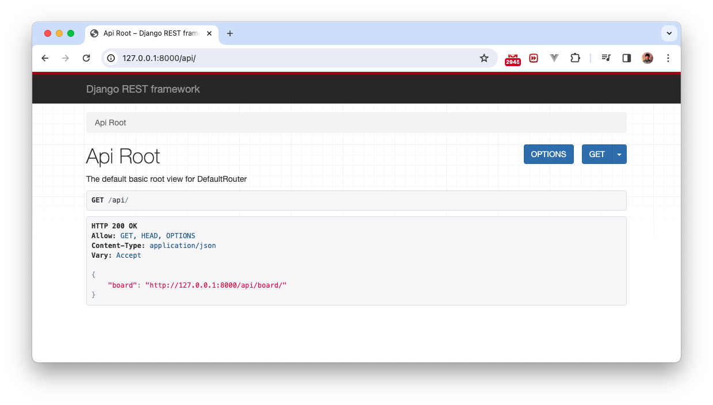
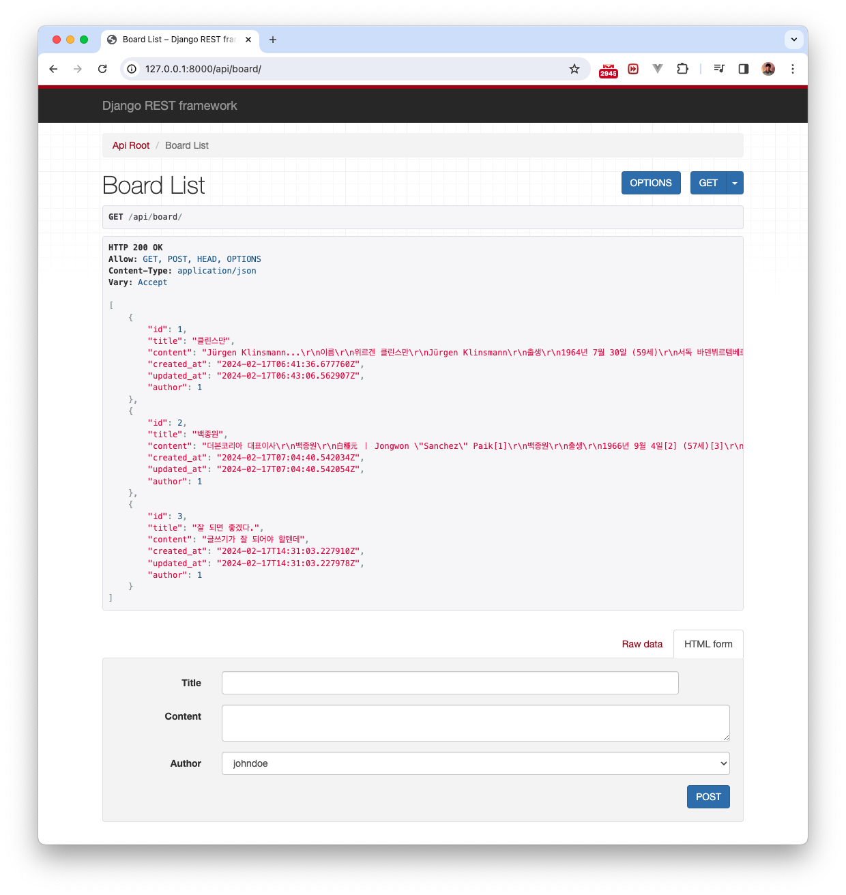

## DRF (Django Rest Framework) API 만들기
Django로 API 만들 때는 [Django Rest Framework](https://www.django-rest-framework.org/) 쓰면 간편하다. 


### DRF Installation
https://www.django-rest-framework.org/#installation

```console
% pip install djangorestframework
% pip install markdown       # Markdown support for the browsable API.
% pip install django-filter  # Filtering support
```

Add 'rest_framework' to your INSTALLED_APPS setting.
```python
# 프로젝트명/settings.py
...

INSTALLED_APPS = [
    'django.contrib.admin',
    'django.contrib.auth',
    'django.contrib.contenttypes',
    'django.contrib.sessions',
    'django.contrib.messages',
    'django.contrib.staticfiles',
    
    'rest_framework',
    
    'single_pages',
    'board',
]

...
```

프로젝트명/urls.py에도 아래 내용 추가

```python
# 프로젝트명/urls.py
from django.contrib import admin
from django.urls import path, include
from rest_framework import routers      #
from board import views as board_views  #

router = routers.DefaultRouter()    #
router.register(r'board', board_views.BoardViewSet) #

urlpatterns = [
    path('board/', include('board.urls')),
    path('admin/', admin.site.urls),
    path('api/', include(router.urls)), #
    path('', include('single_pages.urls')),
]

```
`board/views.py`에 아래 내용 추가
```python
# board/views.py
... 

from rest_framework import viewsets
from .serializers import BoardSerializer

...
    
class BoardViewSet(viewsets.ModelViewSet):
    queryset = Board.objects.all()
    serializer_class = BoardSerializer
```
serializer를 정의하지 않았으므로, board 폴더에 `serializers.py` 생성하고 아래 내용 추가

```python
# board/serializers.py
from rest_framework import serializers
from .models import Board

class BoardSerializer(serializers.ModelSerializer):
    class Meta:
        model = Board
        fields = ('id', 'title', 'content', 'created_at', 'updated_at', 'author')
```

API가 만들어졌다. 

